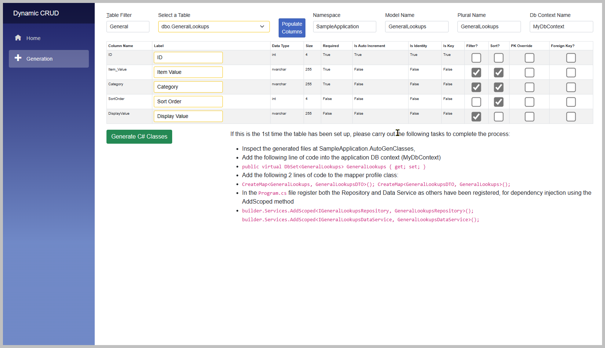

# Blazor CRUD UI Generator

Demo Video: https://youtu.be/5Q4Z7Z8Z3qo

This project can be used to create the classes and Blazor components to provide rudimentary CRUD functionality for any table in SQL Server Database.

The classes are all created within this project under a folder called AutoGenClasses, with the intention of moving them into your project.

## Dependencies

Your project would require the following to be set up:

1. [Automapper](https://automapper.org/) will need to be set up in your project.
2. [Blazored Modal](https://github.com/Blazored/Modal) and [Blazored Toast](https://github.com/Blazored/Toast) will need to be set up.
3. [Ardalis.GuardClauses NuGet Package](https://github.com/ardalis/guardclauses) will also need to be installed.
4. When deleting a record created classes will try to call a Blazor component called BlazoredModalConfirmDialog. This can be found in this project under the Shared folder.
5. Each model will need to exist in your project along with the DB context with the DbSet already added.
6. The Blazor components are set up to use Bootstrap 5.
7. Entity Framework Core.

Please see the sample application project which contains these dependencies, for more information.

## Quick Start - How to Use

1. Edit the appsettings.json file in the root of this project. To make the "DefaultConnection" point to your database in SQL Server.

2. Run the application (Do not run watch as the project will crash when it cannot compile the newly created c# classes).

3. Enter a search term to filter down to a particular table, then select the table in the drop-down list.

4. Click on Populate Columns button.

5. The list of columns should now be displayed.  Check the filter checkboxes for each column that you wish to filter on. Also check each sort column that you wish to sort by.

6. Enter the namespace, this is used to build the namespace for the classes.

7. Enter the singular model name and a plural name. Note the model should already exist in the destination project and be entered in the DB Context.

8. If the primary key is set up correctly the PK Override should not be necessary.  However if the primary key has not been set up correctly it may be necessary to use the override.  In any case a primary key is definitely required.

9. If the table has a parent, you can select a foreign key (One only).

10. Then click Generate C# Classes button, at the bottom of the webpage.

11. The classes should now exist in the AutoGenClasses folder.  Note they will not compile in this project.

12. Copy the code that is displayed red in the webpage into your project, where applicable. 

13. Move each file to the required location in your project.  Taking care to make sure the namespaces are correct.  Build your project and troubleshoot any errors as necessary.

## Files Created

* Model DTO
* Interface and Repository Class
* Interface and Data Service Class
* Model Table Blazor Page Component and Code Behind
* Model Add Edit Blazor Component and Code Behind

## T4 Templates

In order to make any enhancements or changes to the code or user interface, there are 9 T4 Templates for each of the files listed above.

## Please Note

Only tested with:
* Blazor Server (Not Blazor Client)
* SQL Server Database
* .NET 6
* General datatypes like int, long (bigint), bool (bit), DateTime, string (nvarchar) and decimal.

