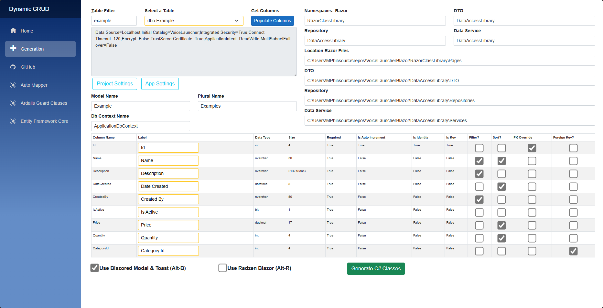

# Blazor CRUD UI Generator



[Demo Video:](https://youtu.be/rJrNwR4Mf7A)


This project can be used to create the C# classes and Blazor components to provide rudimentary CRUD functionality for any table in a SQL Server Database, along with the ability to filter and sort.

Before you can run the automated process you need to enter an entry in the configuration file 'projectMappings.json' in the root of the project.  Note the database name is in fact the name of the connection string in the 'appsettings.json' style.

The namespaces are what will be used in the actual classes so if you want the code to compile first time you need to fill this incorrectly.
 
The folders are what the system will use to place the files in your project. Also note that if the files already exist they will be overridden.

```json
    "Projects": [
        {
            "DatabaseName": "TemplateDatabase",
            "Namespaces": {
                "RazorNamespace": "BlazorApp.Template.Components",
                "DtoNamespace": "BlazorApp.Template",
                "DataServiceNamespace": "BlazorApp.Template",
                "RepositoryNamespace": "BlazorApp.Template"
            },
            "Folders": {
                "RazorFolder": "C:\\Users\\MPhil\\source\\repos\\DevelopmentTemplate_24\\BlazorApp.Template\\BlazorApp.Template\\Components\\Pages",
                "DtoFolder": "C:\\Users\\MPhil\\source\\repos\\DevelopmentTemplate_24\\BlazorApp.Template\\BlazorApp.Template\\DTO",
                "DataServiceFolder": "C:\\Users\\MPhil\\source\\repos\\DevelopmentTemplate_24\\BlazorApp.Template\\BlazorApp.Template\\Services",
                "RepositoryFolder": "C:\\Users\\MPhil\\source\\repos\\DevelopmentTemplate_24\\BlazorApp.Template\\BlazorApp.Template\\Repositories"
            }
        }
    ]
```

Primarily it is done this way so that your project no matter how it is configured will not affecct the running of this appllication. Unlike the MVC scaffolding that stops working if you make too many changes in a project.

## Dependencies

Your project would require the following to be set up:

1. [Automapper](https://automapper.org/) will need to be set up in your project.
2. [Ardalis.GuardClauses NuGet Package](https://github.com/ardalis/guardclauses) will also need to be installed.
3. When deleting a record created classes will try to call a Blazor component called BlazoredModalConfirmDialog*. This can be found in this project under the Shared folder.
4. Each model will need to exist in your project along with the DB context with the DbSet already added.
5. The Blazor components are set up to use Bootstrap 5 by default.
6. Entity Framework Core.

* If you opt to not use Blazored Modal / Blazored Toast, for compatibility with an MVC application. You will need to copy across BlazoredModalConfirmDialogMVC instead.

Please see the sample application project which contains these dependencies, for more information.

## Quick Start - How to Use (see video above)

1. Edit the appsettings.json file in the root of DynamicCRUD project. To make the "DefaultConnection" point to your database in SQL Server.

2. Run the application and navigate to the CRUD Generator page, optionally select a different project to connect to if the default is not the one you want. 

3. Optionally, enter a search term to filter down to a particular table, then select the table in the drop-down list.

4. Click on Populate Columns button.

5. The list of columns should now be displayed.  Check the filter checkboxes for each string column that you wish to filter on. Also check each sort column that you wish to sort by.

6. Enter the singular model name and a plural name. Note the model should already exist in the destination project and be entered in the DB Context.

7. If the primary key is set up correctly the PK Override should not be necessary.  However if the primary key has not been set up correctly it may be necessary to use the override.  In any case a primary key is definitely required for CRUD operations to be successful.

8. If the table has a parent, you can select a foreign key (One only).

9. Then click Generate C# Classes button, at the bottom of the page.

10. You should now be asked to confirm you wish to overwrite any existing files.  Click Yes to proceed.

11. Copy the code that is displayed in the text boxes into your project, where applicable. Note you can click the Copy button to the right of each box.

12. You can now switch to your project and attempt to compile. Good luck and happy coding!

## Files Created

* Model DTO
* Interface and Repository Class
* Interface and Data Service Class
* Model Table Blazor Page Component and Code Behind
* Model Add Edit Blazor Component and Code Behind

## T4 Templates

In order to make any enhancements or changes to the code or user interface, there are 9 T4 Templates for each of the files listed above.

## Please Note

Only tested with:
* Blazor Server (Not Blazor Client)
* SQL Server Database
* .NET 6/7/8
* General datatypes like int, long (bigint), bool (bit), DateTime, string (nvarchar) and decimal.
* Now works in an MVC application that uses Blazor project as well. 
